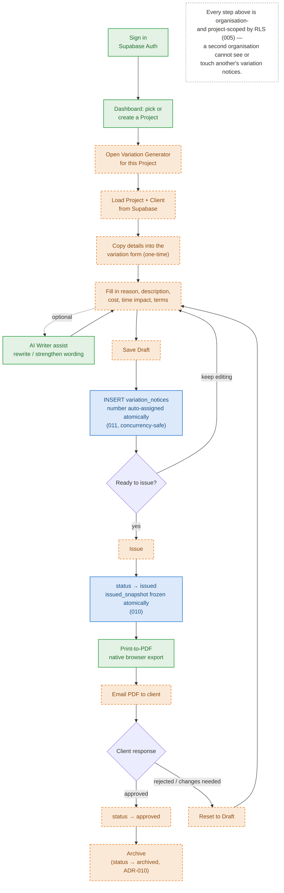

# Variation Notice — Complete Lifecycle

**Purpose:** One-page reference for the full Variation workflow — what's already built, what's newly built this phase, and what's still a real gap. Requested alongside the concurrency-safe number generator (`011`), before frontend integration begins.
**Owner:** BIK Solutions Pty Ltd
**Status:** Reference diagram, current as of 2026-07-31.

This is the shape of the thing the user's earlier framing named directly: not a data migration, but the first connection of Authentication, Organisation, Projects, Variation Notice, AI Writer, PDF, and (eventually) Email into one workflow. The diagram below shows exactly which of those seven are already connected, which are new database work from this phase, and which remain to be built.

## Legend

| | Meaning |
|---|---|
| 🟢 **Built** | Already live today, unaffected by this migration — Supabase Auth (Phase 2), `app-dashboard.html` project picker (Phase 2), AI Writer (Cloudflare Worker proxy), native print-to-PDF (`js/toolkit/exporter.js`, ADR-007). |
| 🔵 **New this phase** | Database work completed/drafted in this session — `variation_notices` (010, applied live), the concurrency-safe number generator (011, drafted), `issued_snapshot` capture, tenant isolation. |
| 🟠 **Not yet built** | Real gaps — every step of connecting the Variation Generator *UI* to this backend (still `localStorage`-only today), and the email-to-client capability, which doesn't exist anywhere in the codebase yet. |

## Why this shape, specifically

- **The Draft ⇄ Save loop (F → H → I → J → F) is unlimited.** A variation can be edited and re-saved any number of times while in draft — nothing about the schema restricts this, and `issued_snapshot` stays `null` throughout (verified, see `docs/PHASE_3_VARIATION_NOTICES_SCHEMA.md`).
- **The moment it matters is Issue (K → L).** That's where `variation_number` (if not already manually set) gets its final, collision-free value and `issued_snapshot` freezes — the two pieces of database work this phase specifically hardened, because that's the exact moment a Variation Notice stops being a draft and becomes a document of record, "exactly how accounting systems behave."
- **Reset-and-reissue (Q → F → ... → L) is a real, supported path, not an edge case.** A rejected variation can be corrected and re-issued; the snapshot correctly refreshes to the new issue event each time (verified under both local and live testing).
- **PDF is a carry-over, not new work.** The existing document engine already does native browser print-to-PDF for every tool (ADR-007) — Variation Notice gets this for free once wired up, the same as every other tool built on `js/toolkit/engine.js`.
- **Email is the one genuinely new capability with no existing foundation anywhere in the codebase.** Worth naming explicitly rather than letting it hide inside "wire up the frontend" — it's a different kind of work (an outbound email integration) from the rest of this list.
